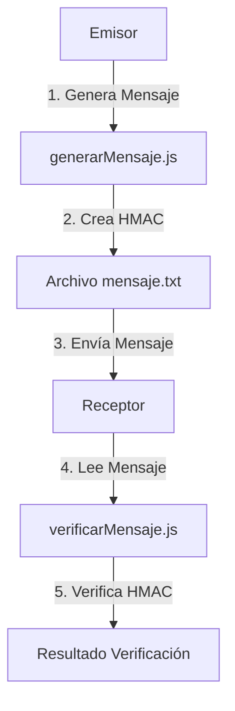
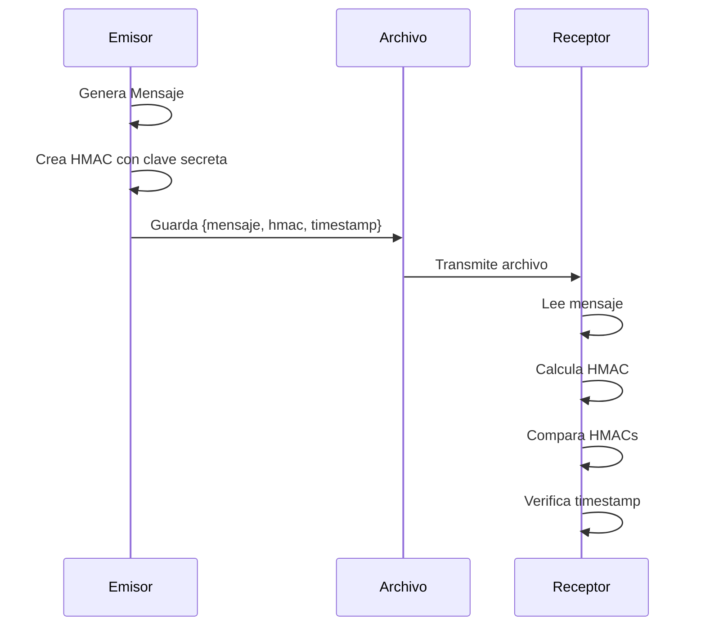
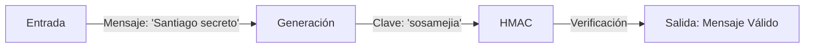

# Proyecto de Criptografía: Hashing & Access Authentication Code

## Descripción General
Este proyecto contiene dos componentes principales:
1. Implementaciones en Python realizadas en clase para comprender la generación de hashes y códigos de autenticación de mensajes (MAC)
2. Implementación en JavaScript como actividad complementaria para reforzar los conceptos en otro lenguaje

## Ejemplos de Ejecución

### Generación de Mensaje

*Figura 1: Proceso de generación de mensaje con HMAC*

### Verificación de Mensaje

*Figura 2: Proceso de verificación del mensaje*

## Diagrama del Proceso



## Flujo de Seguridad



## Componentes del Proyecto

### Implementaciones en Python (Clase)
- `Python/Hola.py`: Implementación básica de Python
- `Python/HolaHMac.py`: Implementación de HMAC (Hash-based Message Authentication Code) usando SHA-256
- `Python/Simetrico/`: Directorio que contiene implementaciones de cifrado simétrico

### Implementación en JavaScript (Tarea)
- `IntercambioMensajes/generarMensaje.js`: Genera mensajes con su correspondiente HMAC
- `IntercambioMensajes/verificarMensaje.js`: Verifica la integridad de los mensajes recibidos

## Objetivos de la Actividad en JavaScript
- Aplicar funciones criptográficas básicas en JavaScript
- Simular el comportamiento de un MAC (Message Authentication Code)
- Explorar el uso de JavaScript para seguridad en mensajes

## Instrucciones de la Actividad

### 1. Obtención de Hash
El estudiante debe:
- Utilizar SHA-256 mediante `crypto.subtle.digest` o la librería `crypto` de Node.js
- Mostrar en consola tanto el texto original como el hash resultante
- Entregar código comentado y estructurado claramente

### 2. Simulación de MAC
Implementación de un sistema que:
- Simula el intercambio de mensajes mediante archivos locales
- Cada mensaje contiene:
  - Texto original
  - Hash/HMAC correspondiente
  - Clave secreta (simulada)
- Incluye explicación del proceso y contenido

## Estructura del Mensaje
El mensaje se guarda en formato JSON con la siguiente estructura:
```json
{
  "mensaje": "texto del mensaje",
  "hmac": "código HMAC generado",
  "timestamp": "fecha y hora de generación"
}
```

## Ejemplo de Ejecución



## Cómo Ejecutar

### Python (Clase)
1. Activar el entorno virtual:
```bash
cd Cifrado
.\Scripts\Activate.ps1  # En Windows PowerShell
```

2. Ejecutar los ejemplos:
```bash
python Python/HolaHMac.py
```

### JavaScript (Tarea)
1. Generar un mensaje:
```bash
node IntercambioMensajes/generarMensaje.js
```

2. Verificar el mensaje:
```bash
node IntercambioMensajes/verificarMensaje.js
```

## Seguridad
- La clave secreta es compartida entre el emisor y el receptor
- El HMAC garantiza que el mensaje no ha sido modificado
- El timestamp permite verificar la frescura del mensaje

## Notas Importantes
- En un entorno real, la clave secreta debería ser compartida de forma segura
- El archivo `mensaje.txt` simula el canal de comunicación
- La verificación del HMAC asegura la integridad del mensaje

## Requisitos
- Python 3.x
- Node.js (para las implementaciones en JavaScript)
- Entorno virtual de Python (en el directorio `Cifrado/`) 